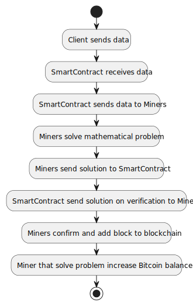
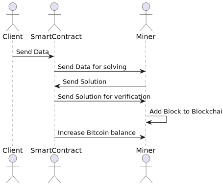

# BlockChain
Ovaj projekat se bavi implementacijom blockchain mreže koja simulira rad rudara (miner-a) koji rade na rešavanju matematičkih zadataka kako bi se takmičili za dobijanje nagrade u bitcoin valuti.
Smart contract reguliše rad miner-a i poseduje informacije o svim registrovanim miner-ima i klijentima.
Klijenti šalju podatke za čuvanje u blockchain mrežu.

## Namena:
Namena ovog projekta je da se simulira rad blockchain mreže koja se bazira na konceptu miner-a koji rešavaju matematičke zadatke i dobijaju nagradu u bitcoin valuti.
Projekat takođe ima za cilj da pruži decentralizovanu bazu podataka koja je sigurna i koja osigurava integritet podataka.

## Problem:
Glavni problem koji ovaj projekat rešava je implementacija blockchain mreže koja simulira rad miner-a i njihovo takmičenje za dobijanje nagrade.
Projekat takođe rešava problem decentralizovane baze podataka koja je sigurna i koja osigurava integritet podataka.

## Rešenje:
Projekat rešava ovaj problem implementacijom blockchain mreže koja se bazira na konceptu miner-a koji rešavaju matematičke zadatke i dobijaju nagradu u bitcoin valuti.
Smart contract reguliše rad miner-a i poseduje informacije o svim registrovanim miner-ima i klijentima.
Klijenti šalju podatke za čuvanje u blockchain mrežu.
Implementirani algoritam za generisanje HASH vrednosti i matematički zadatak koji miner-i rešavaju pomažu u osiguravanju integriteta podataka u blockchain mreži.

## Struktura:
Projekat se sastoji od tri glavne komponente: miner-a, smart contract-a i klijenata.

Miner-i rešavaju matematičke zadatke i čuvaju podatke u decentralizovanoj bazi podataka (blockchain-u).
Smart contract vrši prijem podataka od klijenata, šalje ih minerima na validaciju i čuvanje, te reguliše rad miner-a.

Klijenti šalju podatke za čuvanje u blockchain mrežu.

Projekat takođe koristi kriptografske algoritme i protokole za šifrovanje podataka i osigurava sigurnost podataka u blockchain mreži.
